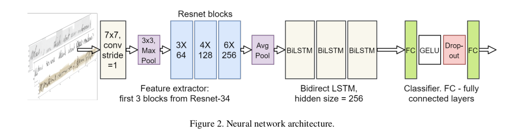
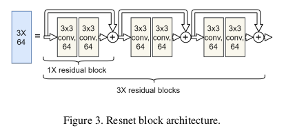
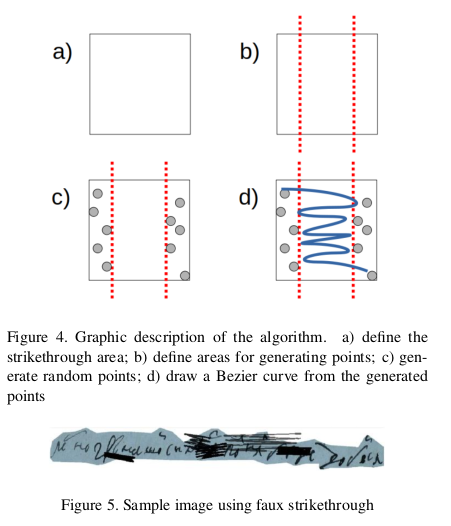
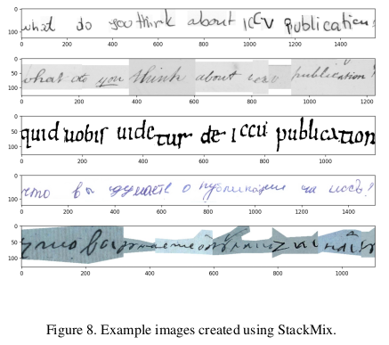
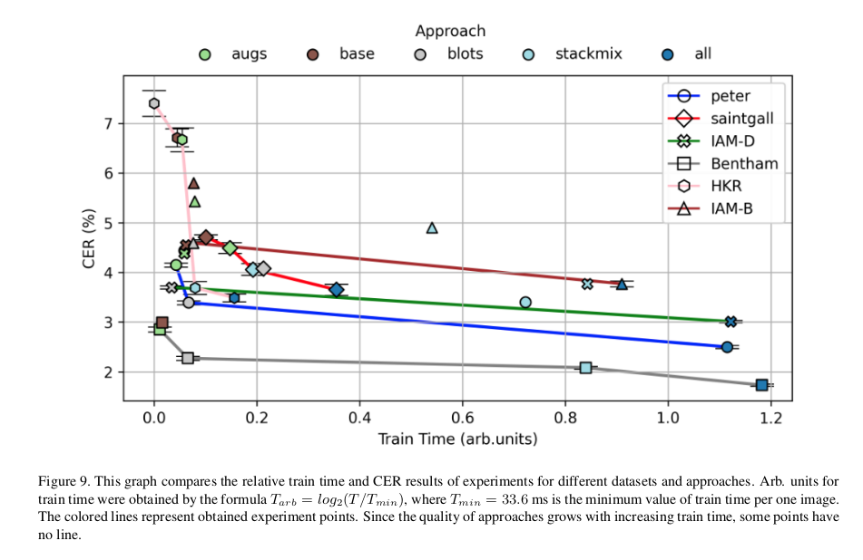
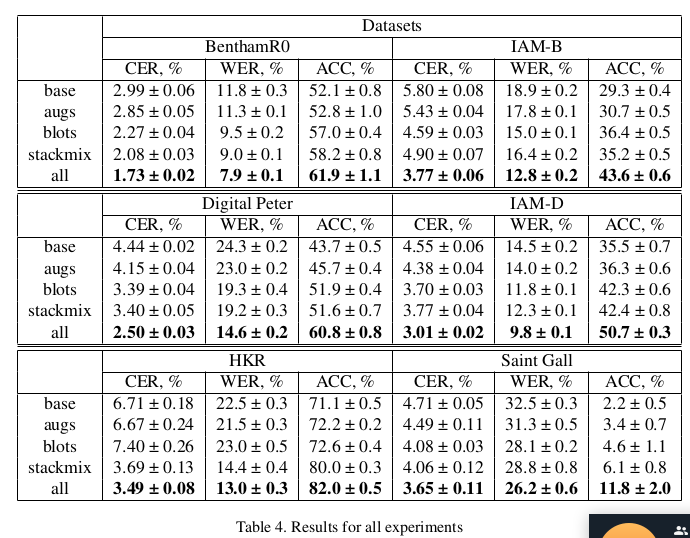
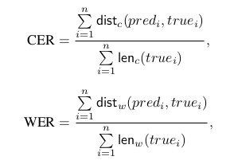

Table of content

[StackMix and Blot Augmentations for Handwritten Text Recognition](#stackmix)  
[Connectionist Temporal Classification (CTC)](#ctc)  
[Attention-basedFullyGatedCNN-BGRU](#Attention_basedFullyGatedCNN_BGRU)  

#  Models
## Bluche
The encoder in the Bluche model contains 3x3 Conv layer with8 features, 2x4 Conv layer with 16 features, a 3x3 gated Conv layer,3x3 Conv layer with 32 features, 3x3 gated Conv layer, 2x4 Conv layer with 64 features and 3x3 Conv layer with 128 features. Thedecoder contains 2 bidirectional LSTM layers of 128 units and 128 dense layer between the LSTM layers. Figure 5 shows the Bluche architecture.


Datasets
1. handwritten cites in Cyrillic words
2. HKR

## Puigcerver

The Puigcerver model has three important parts : 1.Convolutional blocks: they include 2-D Conv layer with 3x3 kernal size and 1 horizontal and vertical stride. number of filters is equal to 16n at the n-th layer of Conv.2. Recurrent blocks: Bidirectional 1D-LSTM layers form re- current blocks, that transfer the input image column-wise from left to right and from right to left. The output of the two directions is concatenated depth-wise. 3. Linear layer: the output of recurrent 1D-LSTM blocks are fed to linear layer to predict the output label. Dropout is implemented before the Linear layer to prevent overfitting (also with probability 0.5).  


Datasets
1. handwritten cites in Cyrillic words
2. HKR


<a name="stackmix"></a> 
# StackMix and Blot Augmentations for Handwritten Text Recognition
paper [arxiv](https://arxiv.org/abs/2108.11667)  [paperswithcode](https://paperswithcode.com/paper/stackmix-and-blot-augmentations-for)

Datasets Used [IAM](https://paperswithcode.com/dataset/iam) [HKR](https://paperswithcode.com/dataset/hkr) [HKR-Dataset](https://github.com/abdoelsayed2016/HKR_Dataset) [Digital-Peter](https://paperswithcode.com/dataset/digital-peter) [cyrillic-handwriting-dataset-kaggle](https://www.kaggle.com/datasets/constantinwerner/cyrillic-handwriting-dataset) [HKR-huggingface](https://huggingface.co/datasets/nastyboget/stackmix_hkr)

examples [StackMix-OCR-github](https://github.com/ai-forever/StackMix-OCR)

### Method
Our method comprises three parts. Section 3.1 describes
the modified Resnet neural network architecture we used.
Sections 3.2 proposes a new augmentation method that sim-
ulates strikethrough text – Handwritten Blots. Finally, Sec-
tion 3.3 describes how to significantly increase the amount
of training data generating new text in the style of the cur-
rent dataset (StackMix approach).

### Neural Network Architecture


The neural network underlying the proposed system con-
sists of three parts: a feature generator, a recurrent network
to account for the order of the features, and the classifier
that outputs the probability of each character.
As a function generator, various network architectures
were tested, and the final choice fell on Resnet (Fig. 2). We
took only three first blocks from Resnet-34 and replaced
the stride parameter in the first layer with 1 to increase the
”width” of the objects. One Resnet block (Figure 3) con-
sisted of 3, 4, and 6 residual blocks with 64, 128, and 256
output layers, respectively.
After the features were extracted, they were averaged
through the AdaptiveAvgPool2d layer and fed into the three
BiLSTM layers to deal with feature sequences. As a final
classifier, we use two fully connected layers with GELU
and dropout between them.
The results achieved using the described architecture
without any additional modifications are shown in the
”base” row of Table 4.

### Blot Augmentation


### StackMix
The StackMix Algorithm is a method used to create new images from text input, using parts of images from a training dataset. The algorithm uses nltk MWETokenizer for tokenization, which processes tokenized text and merges multi-word expressions into single tokens. These collections of multi-word expressions are obtained from the training dataset. The algorithm then matches each token with a part of an image from the training data, and stacks these pieces together to form a complete image, maintaining the correct order of the tokens. 

The algorithm has been found to significantly increase the quality of recognition, despite visible places where tokens were glued together. The alignment and selection of samples to increase the realism of the generated string did not lead to an increase in metrics in experiments. However, with certain improvements, this algorithm may be used for the realistic generation of new documents. 

In a test, the algorithm was used to generate pages of texts from different sources, including paragraphs from the first chapter of a Harry Potter book. The results suggest that it is possible to generate different texts with different styles and fonts. For models of English language, the original Harry Potter book was used, and for models that had Cyrillic symbols, the Russian version of the Harry Potter book was used.


### Datasets
Bentham, The IAM, Digital Peter, HKR Dataset, Saint Gall

### Metrics




В тексте рассматриваются различные методы и подходы к распознаванию рукописного текста (HTR) с использованием моделей глубокого обучения. В начале излагаются первые работы по проблемам распознавания рукописного текста, в которых использовалась комбинация скрытых марковских моделей и рекуррентных нейронных сетей (RNN) или алгоритмы на основе условных случайных полей. Однако было обнаружено, что эти подходы имеют свои недостатки, в частности, невозможность оптимизации сквозной функции потерь.

В 2006 году был представлен новый подход, известный как коннекционистская темпоральная классификация (CTC). Этот подход интерпретирует выходные данные сети как распределение вероятностей по всем возможным последовательностям меток, обусловленным заданной входной последовательностью. Это позволяет получить целевую функцию, которая непосредственно максимизирует вероятности правильных меток. Поскольку объективная функция дифференцируема, сеть может быть обучена стандартным методом обратного распространения во времени. В рамках этого подхода были введены потери CTC, которые нашли широкое признание среди исследователей и стали стандартом де-факто для распознавания рукописных работ.

Также были упомянуты MDLSTM-сети, использующие 2D-RNN. Эти сети могут работать с обеими осями входного изображения и состоят из нескольких слоев CNN и MDLSTM. Однако эти модели имеют ряд недостатков, таких как высокая вычислительная стоимость и нестабильность. Для решения этих проблем были предложены различные методы, такие как метод "упаковки примеров" из работы [10] и исключение рекуррентных слоев в CNN-LSTM-CTC для уменьшения количества параметров ieeexplore.ieee.org.

В качестве альтернативы подходу RCNN-CTC были также предложены модели Seq2seq. Эти модели используют кодер для извлечения признаков из входного сигнала и декодер с механизмом внимания для последовательной выдачи выходного сигнала. Обычные приемы могут существенно улучшить качество HTR-моделей arxiv.org.

Далее в тексте рассматривается новый метод дополнения данных, имитирующий зачеркнутый текст, известный как Handwritten Blots. Этот метод был разработан в ходе анализа набора данных Digital Peter и предполагает использование аугментации Cutout [12] для создания эффекта, похожего на перечеркнутые символы. Реализация этого алгоритма предполагает использование алгоритма построения кривой Безье для сглаживания перехода кривой между точками arxiv.org.

Наконец, в тексте описывается предложенная модель, состоящая из трех частей: модифицированной архитектуры нейронной сети Resnet, нового метода аугментации, имитирующего зачеркнутый текст, и метода значительного увеличения объема обучающих данных за счет генерации нового текста в стиле текущего набора данных. Результаты, полученные при использовании этой архитектуры без дополнительных модификаций, приведены в табл. 4, а влияние дополнения Blot на метрики качества также обсуждается arxiv.org.

<a name="ctc"></a> 
# Connectionist Temporal Classification (CTC)
Начиная с 2007 года LSTM приобрела популярность и смогла вывести на новый уровень распознавание речи, показав существенное улучшение по сравнению с традиционными моделями.[6] В 2009 году появился подход классификации по рейтингу (англ. Connectionist temporal classification, CTC). Этот метод позволил рекуррентным сетям подключить анализ контекста при распознавании рукописного текста.[7] В 2014 году китайская энциклопедия и поисковая система Baidu, используя рекуррентные сети с обучением по CTC смогли поднять на новый уровень показатели Switchboard Hub5’00, опередив традиционные методы.

Connectionist Temporal Classification (CTC) - это метод, используемый для обучения рекуррентных нейронных сетей (RNN) для обработки последовательностей данных. Этот метод особенно полезен для задач, где данные представляют собой последовательности, такие как распознавание речи или рукописного текста [ru.wikipedia.org](https://ru.wikipedia.org/wiki/%D0%A0%D0%B5%D0%BA%D1%83%D1%80%D1%80%D0%B5%D0%BD%D1%82%D0%BD%D0%B0%D1%8F_%D0%BD%D0%B5%D0%B9%D1%80%D0%BE%D0%BD%D0%BD%D0%B0%D1%8F_%D1%81%D0%B5%D1%82%D1%8C).

CTC представляет новую функцию потерь, которая позволяет сетям RNN напрямую использовать обучение памяти несегментированных последовательностей. Это означает, что CTC может работать с последовательностями данных, которые не были предварительно разделены на отдельные сегменты или "блоки". Вместо этого, CTC позволяет сетям RNN учиться на основе всего входного последовательного потока данных [russianblogs.com](https://www.russianblogs.com/article/3121270981/).

В контексте CTC, "соединитель" относится к способности сети учиться на основе последовательности входных данных, а "временной" относится к способности сети учиться на основе последовательности во времени. "Классификация" означает, что CTC используется для задач классификации, где выходной результат - это определенный класс или категория.

Важно отметить, что CTC не предназначен для прогнозирования последовательности, поскольку он может только прогнозировать классификацию некоторых независимых меток. Однако, CTC обеспечивает мощный общий механизм для построения временных рядов и очень устойчив к временным и пространственным шумам.

Важным аспектом CTC является использование "пустой" метки. Это специальная метка, которая может быть выведена на RNN. Выход RNN - это вероятность всех меток. Это позволяет CTC учиться на основе всего входного последовательного потока данных, а не только на отдельных сегментах.

В целом, CTC представляет собой мощный инструмент для обучения рекуррентных нейронных сетей на последовательных данных. Он обеспечивает гибкость и устойчивость к шумам, что делает его полезным для многих задач обработки последовательностей.

Connectionist Temporal Classification (CTC) - это функция потерь, используемая для обучения рекуррентных нейронных сетей (RNN) для маркировки неразделенных входных последовательностей данных в обучении с учителем.

В контексте распознавания речи, например, с использованием типичной функции потерь кросс-энтропии, входной сигнал должен быть разделен на слова или подслова. Однако, используя функцию потерь CTC, достаточно предоставить одну последовательность меток для входной последовательности, и сеть учится как выравнивать, так и маркировать.

CTC позволяет добиться как упорядочивания, так и распознавания. Многие рекуррентные сети используют стеки данных, присущие CTC, чтобы найти матрицу весов, в которой вероятность последовательности меток в наборе образцов при соответствующем входном потоке сводится к максимуму.

В MXNet реализована функция CTC-loss, которая включена в стандартный пакет. Также есть возможность использовать функцию CTC-loss с помощью библиотеки Baidu's warp-ctc, что требует сборки обеих библиотек из исходного кода [mxnet.apache.org](https://mxnet.apache.org/versions/1.2.1/tutorials/speech_recognition/ctc.html).

В качестве примера, MXNet предоставляет пример использования CTC-loss с сетью LSTM для выполнения предсказания распознавания текста на изображениях CAPTCHA. Этот пример демонстрирует использование обоих вариантов CTC-loss, а также инференции после обучения с использованием контрольных точек символа и параметров сети.

Коннекционистская временная классификация (Connectionist Temporal Classification Loss, или CTC Loss) предназначена для задач, в которых требуется выравнивание последовательностей, но такое выравнивание затруднено - например, выравнивание каждого символа по его местоположению в аудиофайле. Он рассчитывает потери между непрерывным (несегментированным) временным рядом и целевой последовательностью. Для этого суммируются вероятности возможных выравниваний входных данных с целевыми, в результате чего получается значение потерь, дифференцируемое относительно каждого входного узла. Предполагается, что выравнивание входной и целевой последовательности происходит по принципу "многие к одному", что ограничивает длину целевой последовательности таким образом, что она должна быть ≤ длины входной.

<a name="Attention_basedFullyGatedCNN_BGRU"></a>
# Attention-basedFullyGatedCNN-BGRU
Наша модель ориентирована на извлечение кириллической символики в рукописном виде. Предлагаемая модель основана на архитектуре Attention-Gated-CNN-BGRU с небольшим количеством параметров (около 885,337), что обеспечивает высокую скорость распознавания, компактность и быстродействие, а также меньшую погрешность по сравнению с другими моделями. Алгоритм состоит из шести этапов, которые будут описаны следующим образом: 

  1. предварительная обработка: изменение размера с разбивкой на страницы (1024x128), компенсация освещенности и рекурсивная обработка изображений в файлах формата HDF5 

  2. извлечение характеристик с помощью CNN-слоев 

  3. механизм внимания Bahdanau, который заставляет модель обращать внимание на входные данные и соотносить их с выходными данными. 

  4. Сопоставление последовательности признаков с помощью RRN 

  5. Расчет потерь/декодирование в текст или формат (CTC) 6.Постобработка для улучшения конечного текста

## Модель
В данном разделе мы опишем модель, в которой происходит передача сигнала через GatedCNN, затем процесс внимания по Bahdanau, bi-directionalGRU и, наконец, матрицу выхода из GRU к коннекционистско-темпоральной классификации (CTC) для вычисления величины потери и декодирования матрицы вывода в конечном контексте.  
Модель состоит из четырех основных частей: энкодер, внимание, декодер и CTC. 

Энкодер 

Conventional blocks. Энкодер получает входной сигнал и генерирует векторы признаков. Эти векторы признаков содержат информацию и характеристики, которые представляют входной сигнал.

Энкодерная сеть состоит из 5 конволюционных блоков, которые соответствуют обучению извлечению релевантных признаков из изображений. В каждом блоке выполняется операция преобразования, в ходе которой в первом, втором, четвертом и шестом блоках применяется ядро свертки размера(3,3), а в третьем и пятом блоках -(2,4), затем применяются ParametricReLU и BatchNormalization, а для уменьшения overfitting применяется Dropout в некоторых слоях преобразования (с вероятностью dropout равной 0,2).

## Слой Gated Conventional Layer.

Идея gate controls состоит в том, чтобы передавать векторный признак на следующий слой. Слой Gatelayer рассматривает значение векторного признака в данной позиции, а также соседние головные значения и определяет, следует ли его удерживать или отбрасывать в данной позиции. Слой gate(g) реализуется как слой разрешения со слоем активации. Он добавляется к входной функции maps(x). Выходной сигнал газового механизма представляет собой поэлементное умножение (point-wise multiplication) входов и выходов затвора.

## Механизм внимания

Внимание - это механизм, который обеспечивает явное кодирование исходных последовательностей (h1, ...., hs), способствующих построению контекстного вектора (ct), а затем его использование декодером. Внимание позволяет модели понять, на какие закодированные изображения в источнике следует обратить внимание, и в какой степени при этом происходит предсказание целевой последовательности. Скрытое состояние последовательности источников получается из кодера на каждом шаге ввода, а не из скрытого состояния на последнем шаге.

В целевой последовательности для каждого выходного слова явно строится контекстный вектор (ct). Сначала с помощью нейросети каждое скрытое состояние кодера градуируется и нормируется на вероятность по отношению к скрытым состояниям кодировщиков. Наконец, вероятности используются для вычисления взвешенной суммы скрытых состояний кодера, чтобы предоставить контекстную информацию, которая должна использоваться в кодере. Слой внимания выдает результаты размером 128x 256.

## Decoder

Декодер представляет собой двунаправленную рекуррентную сеть (GRU), которая обрабатывает последовательность признаков и предсказывает последовательности символов. Вектор признаков содержит 256 признаков с шагом по времени, и текущая нейронная сеть распространяет информацию через эту последовательность. Реализация RNN вGRU используется в качестве механизма сглаживания в рекуррентных нейронных сетях (RNN), почти как расширенный модуль LSTM без выходного затвора. GRU пытается раскрыть материю убывающего градиента. AGRU'scans решает проблему сходящегося градиента с помощью шлюза обновления и шлюза сброса. Шлюз обновления управляет информацией, поступающей в память, а шлюз сброса - информацией, поступающей в память. Шлюзы обновления и сброса представляют собой два вектора, которые определяют, какая информация будет передана на выход. Они могут быть отменены, чтобы сохранить прошлые знания или удалить информацию, не имеющую отношения к прогнозированию.GRU похож на LSTM, но содержит меньшее количество параметров, поскольку не имеет достаточной скорости для вывода. Выходная последовательность RNN-слоя представляет собой матрицу размером 128x96.

## Connectionist Tempora Classification (CTC)

Нейронные сети имеют разные цели обучения для каждого участка входной последовательности на каждом временном шаге. Это имеет два важных следствия. Во-первых, это означает, что обучающие данные должны быть предварительно сегментированы для определения целей. Во-вторых, поскольку сеть генерирует только локальные классификации, глобальные аспекты последовательности (например, вероятность последовательного повторения меток) должны быть смоделированы извне. Действительно, конечная последовательность меток не может быть надежно определена без некоторой предварительной обработки. Это достигается за счет того, что при условии корректности общей последовательности меток в каждый момент времени на входе можно делать прогнозы по меткам. Это позволяет отказаться от предварительной сегментации базы данных, так как выравнивание меток по входу уже не имеет значения.

Кроме того, CTC напрямую предоставляет полные вероятности последовательности меток, что обеспечивает отсутствие необходимости дополнительной постобработки для использования сети в качестве временного классификатора. При обучении NN CTC получает выходную матрицу RNN и текст, содержащий ground truth, и вычисляет величину потерь. В процессе распознавания CTC получает матрицу и декодирует ее в конечный текст.

Функция потерь: Для заданного входного сигнала мы хотели бы обучить модель максимизации вероятности того, что ей будет присвоен правильный ответ. Для этого необходимо вычислить условную вероятностьp(Y|X). Функцияp(Y|X)должна также иметь дифференциалы, чтобы ее можно было использовать по возрастающей.

# Для презентации
Работа "Classification of Handwritten Names of Cities and Handwritten Text Recognition using Various Deep Learning Models" описывает исследование в области распознавания рукописного текста с помощью различных моделей глубокого обучения. Основная идея заключается в использовании глубокого обучения для классификации рукописных названий городов и распознавания рукописного текста.

В работе используются различные модели глубокого обучения, включая сверточные нейронные сети (CNN) и архитектуры последовательность-к-последовательности (seq2seq). CNN используется для идентификации важных признаков, присутствующих в символах, а seq2seq моделирует последовательную природу текста для построения его транскрипции 7.

Структура модели описана следующим образом:

Входные данные представляют собой изображения рукописного текста. Это могут быть названия городов или другие виды рукописного текста.
Эти изображения затем проходят через сверточную нейронную сеть, которая извлекает важные признаки из символов на изображениях.
Затем эти признаки передаются в модель seq2seq, которая моделирует последовательность символов в тексте и генерирует его транскрипцию.
Выходные данные модели - это транскрипция рукописного текста на изображениях.
Стоит отметить, что распознавание рукописного текста - это сложная проблема из-за большого разнообразия стилей письма и низкого качества рукописного текста по сравнению с печатным текстом 2. Несмотря на это, авторы работы смогли применить глубокое обучение для решения этой проблемы.

## CTC
CTC (Connectionist Temporal Classification) Loss играет важную роль в моделях для задач распознавания рукописного текста и других задач, связанных с последовательностями, где входные и выходные последовательности могут иметь разные размеры. Идея CTC заключается в том, чтобы предсказывать вероятность каждого символа в каждый момент времени и затем преобразовать эти вероятности в конечную последовательность символов 7.

CTC Loss не работает на прогнозах argmax, а на всем выходном распределении. CTC Loss - это сумма отрицательной логарифмической вероятности всех возможных выходных последовательностей, которые производят желаемый вывод 1.

В контексте модели, описанной в работе, CTC Loss помогает выравнивать последовательности входных и выходных данных, учитывая, что длина входных изображений рукописного текста и длина выходных транскрипций могут отличаться.

Важным аспектом CTC является введение специального символа (обычно обозначаемого как "blank" или ε), который используется для разделения повторяющихся символов в выходной последовательности. Использование этого специального символа позволяет модели корректно обрабатывать случаи, когда один и тот же символ повторяется в рукописном тексте 7.

В целом, CTC Loss играет ключевую роль в модели, обеспечивая эффективное обучение и высокую точность распознавания рукописного текста.

## объясни ctc-loss поставки словами как для школьника
CTC (Connectionist Temporal Classification) Loss играет ключевую роль в процессе обучения моделей глубокого обучения, которые работают с последовательностями данных разной длины, таких как распознавание речи или рукописного текста. Этот тип потерь помогает модели научиться правильно выравнивать входные и выходные последовательности данных, даже если они имеют разную длину 1.

Представь, что у тебя есть набор изображений с рукописным текстом и ты хочешь, чтобы твоя модель машинного обучения могла преобразовать эти изображения в текст. Однако, каждое изображение может содержать разное количество символов, и ты не можешь заранее знать, сколько символов содержится на каждом изображении. Вот тут и приходит на помощь CTC Loss.

Во-первых, CTC Loss позволяет модели предсказывать последовательности разной длины. Это значит, что модель может генерировать выходные данные (текст) разной длины для каждого входного изображения.

Во-вторых, CTC Loss использует специальный символ, обычно обозначаемый как "blank" или ε, для обозначения отсутствия символа на определенной позиции в выходной последовательности. Этот символ позволяет модели генерировать выходные последовательности, которые могут быть короче или длиннее входных последовательностей, и таким образом, выравнивать входные и выходные данные 2.

CTC Loss функционирует путем подсчета вероятности каждого возможного выравнивания между входной и целевой последовательностью, и затем суммирует эти вероятности, создавая значение потерь, которое можно использовать для обучения модели 5.

Таким образом, можно сказать, что CTC Loss играет роль "переводчика" между входными данными (изображениями рукописного текста) и выходными данными (текстом). Он помогает модели понять, как правильно преобразовать входные данные в выходные, учитывая разные длины входных и выходных последовательностей.

## Как работает процесс обучения с использованием CTC Loss?
Процесс обучения с использованием CTC Loss включает следующие шаги:

1. Входные данные модели представляют собой последовательности, и для каждого временного шага в последовательности модель выдает вектор вероятностей для каждого возможного символа в алфавите (включая специальный символ "blank") 
2. Для расчета CTC Loss, мы должны учесть все возможные выравнивания между входной и целевой последовательностью. Это делается с помощью алгоритма Forward-Backward 
```
- Forward Algorithm: Этот алгоритм вычисляет общую вероятность последовательности до определенного временного шага. Он создает матрицу (α), где α(s, t) представляет общую вероятность последовательности до временного шага t, заканчивающейся на символе s [0](https://ogunlao.github.io/blog/2020/07/17/breaking-down-the-ctc-loss.html).

```

```
- Backward Algorithm: Этот алгоритм вычисляет общую вероятность оставшейся последовательности после определенного временного шага. Он создает другую матрицу (β), где β(s, t) представляет общую вероятность оставшейся последовательности после временного шага t, начинающейся с символа s [0](https://ogunlao.github.io/blog/2020/07/17/breaking-down-the-ctc-loss.html).

```

3. После того как мы получили α и β, мы можем вычислить CTC Loss для каждого временного шага. Мы вычисляем совместную вероятность последовательности на каждом временном шаге, затем вычисляем общую вероятность всех путей, проходящих через каждый символ на каждом временном шаге. Это делается путем суммирования α и β вдоль столбцов. Затем CTC Loss вычисляется как отрицательный логарифм этой общей вероятности
4. После вычисления CTC Loss, градиенты могут быть обратно распространены через модель для обновления весов
Важно отметить, что CTC Loss необходимо использовать вместе с соответствующим методом декодирования на этапе тестирования/инференции. Обычно используется жадное декодирование или декодирование с использованием лучевого поиска

## что такое жадное декодирование ctc-loss
CTC Loss (Connectionist Temporal Classification Loss) используется в задачах, где мы хотим предсказать последовательность элементов, которая может быть другой длины, чем входная последовательность. Это часто встречается в задачах распознавания речи или распознавания рукописного текста, где длина входных данных (например, аудио-сигнала или изображения) может отличаться от длины выходных данных (текста) 5.

Жадное декодирование в контексте CTC Loss - это процесс выбора на каждом временном шаге символа с наибольшей вероятностью. В отличие от более сложных методов декодирования, таких как поиск по лучам (beam search), жадное декодирование не учитывает глобальные взаимосвязи между символами и просто выбирает наиболее вероятный символ на каждом шаге.

Пример кода для жадного декодирования с использованием CTC Loss в PyTorch:
```
def greedy_decoder(output):
    output = output.detach().cpu().numpy()
    decoded_output = []
    for i in range(output.shape[0]):
        decoded_output.append([])
        for j in range(output.shape[1]):
            decoded_output[i].append(np.argmax(output[i][j]))
    return decoded_output
```

В этом коде output - это выходные данные модели, которые представляют собой вероятности различных символов на каждом временном шаге. Мы просто выбираем символ с наибольшей вероятностью на каждом временном шаге и добавляем его в наш декодированный вывод 1.

Важно отметить, что жадное декодирование может не всегда давать оптимальные результаты, поскольку оно не учитывает взаимосвязи между символами. Например, в задачах распознавания речи или распознавания рукописного текста определенные последовательности символов могут быть более вероятными, и жадное декодирование может пропустить эти взаимосвязи 5.

## а что такое cer, wer и как их считать
CER (Character Error Rate) и WER (Word Error Rate) - это метрики, используемые для оценки качества распознавания речи или распознавания рукописного текста. Они измеряют количество ошибок в выходных данных модели по сравнению с исходными данными.

CER (Character Error Rate) измеряет количество ошибок на уровне символов. Это делается путем подсчета минимального количества операций на уровне символов, необходимых для преобразования исходного текста (или "истинного" текста) в выходные данные модели. Операции включают вставки, замены и удаления символов. CER вычисляется как отношение количества этих ошибок к общему количеству символов в исходном тексте 2.

WER (Word Error Rate) измеряет количество ошибок на уровне слов. Это делается путем подсчета минимального количества операций на уровне слов, необходимых для преобразования исходного текста в выходные данные модели. Операции включают вставки, замены и удаления слов. WER вычисляется как отношение количества этих ошибок к общему количеству слов в исходном тексте 2.

Важно отметить, что ни CER, ни WER не всегда являются числами между 0 и 1, особенно когда есть большое количество вставок. Эти значения часто связаны с процентом символов или слов, которые были неправильно предсказаны. Чем ниже значение, тем лучше производительность системы распознавания речи или распознавания рукописного текста. Значение CER или WER равное 0 считается идеальным 9.

Пример кода для вычисления CER и WER на Python:
```
def calculate_cer(reference, hypothesis):
   m = editdistance.eval(reference, hypothesis)
   return m / len(reference)

def calculate_wer(reference, hypothesis):
   words_reference = reference.split()
   words_hypothesis = hypothesis.split()
   m = editdistance.eval(words_reference, words_hypothesis)
   return m / len(words_reference)
```

В этом коде reference - это исходный текст, а hypothesis - это предсказанный текст. Функция editdistance.eval из библиотеки editdistance используется для подсчета минимального количества операций, необходимых для преобразования reference в hypothesis 2.

